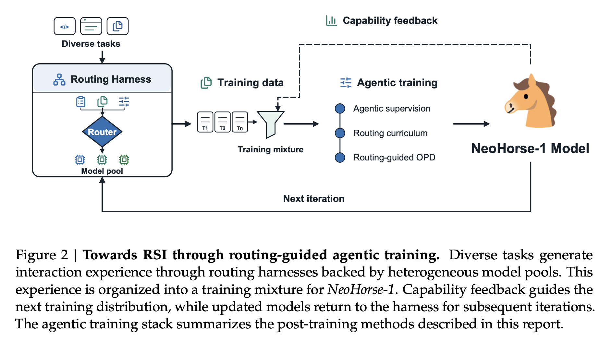

--- 
title: "NeoHorse-1: Towards Recursive Self-Improvement via Agentic Post-Training with Routing Harness" 
date: 2026-09-24 
tags: ["Agent", "RSI"] 
math: true 
draft: false 
meta:
  authors: ["NeoHorse Team et al."]
  venue: ""
  url: "https://arxiv.org/abs/2609.08183"
  year: 2026
  month: 9
---

## 1. Executive Summary

NeoHorse-1 operationalizes recursive self-improvement (RSI) for agentic LLMs. It converts runtime execution telemetry into a closed feedback loop of Curriculum SFT and routing-guided on-policy distillation, lifting macro-average benchmark scores significantly (**4B** model jumps from **58.94** to **64.87**).
## 2. Methods

* **Step1**: Run the harness across diverse tasks to generate trajectories, filtered via semantic grading and tiered via predicted capability.  
* **Step2**: Perform Curriculum SFT on the student model using qualified trajectories
* **Step3**: OPD (online policy distillation ) the student model with a front-tier teacher model
* **Step4**: Evaluate the harness equipped with the student model, analyze its capability and rebalance the sampling weight for the next generation 
  
## 3. Key Mathematical Formulations

**The SFT objective** is as follows:
$$
\mathcal{L}_{\mathrm{SFT}}(\theta ; \mathcal{B})=-\frac{\sum_{i \in \mathcal{B}} \sum_{t=2}^{T_i} m_{i, t} \log p_\theta\left(x_{i, t}\mid x_{i,\lt t}\right)}{\sum_{i \in \mathcal{B}} \sum_{t=2}^{T_i} m_{i, t}}
$$
Where:
* $\mathcal{L}_{\mathrm{SFT}}(\theta ; \mathcal{B})$ is the loss function
* $m_{i, t}$ is the binary token level mask for token  at position $t$ from batch $i$

**The online policy distillation objective** is as follows:

$$
\mathcal{L}_{\mathrm{OPD}}(\theta ; \mathcal{R})=\frac{1}{\sum_{r \in \mathcal{R}} w_r} \sum_{r \in \mathcal{R}} \frac{w_r}{L_r} \sum_{t=1}^{L_r} D_{\mathrm{KL}}\left(\widetilde{P}_{\theta, r, t} \| \widetilde{Q}_{r, t}\right)
$$

Where:
* $\mathcal{L}_{\mathrm{OPD}}$ is the loss function.
* $\widetilde{P}_{\theta, r, t}$ is the student distribution.
* $D_{\mathrm{KL}}$ is the reverse KL divergence.
* $\widetilde{Q}_{r, t}$ is the fixed teacher distribution.
* $L_r$ is the retained response length.
* $w_r$ is a fixed response weight equal to 1 in the unweighted setting.

## 4. Personal Insights

* SFT takes the admitted harness trajectories as the ground truth
* The student generates the sequence while the teacher prefills which are not  involved with RL rewards
* Reverse KL drives student model to concentrate on sharpest mode where teacher presents (**Zero-Forcing**)
