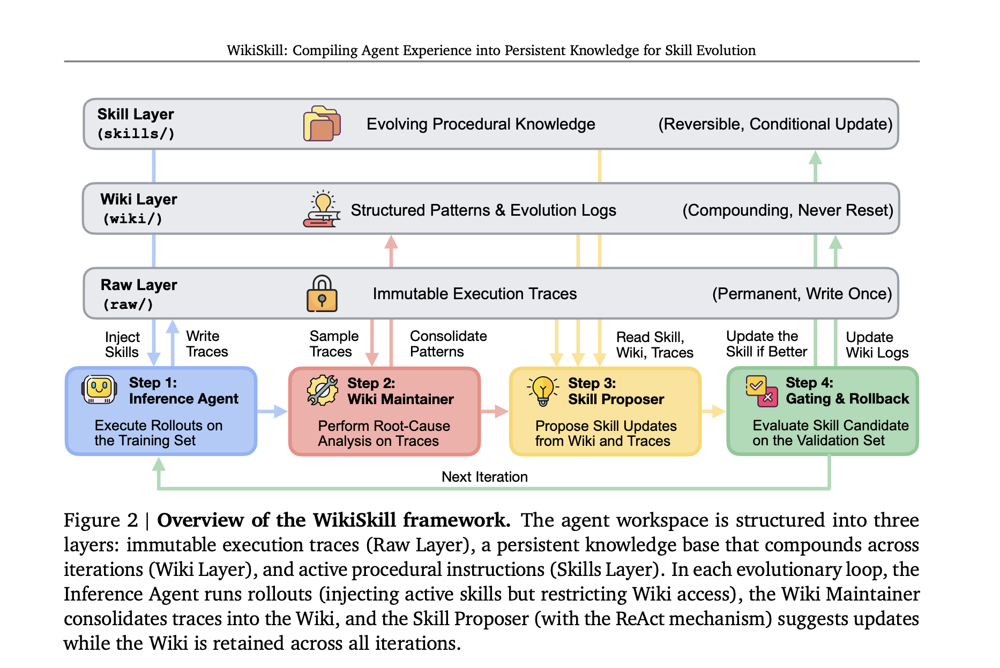
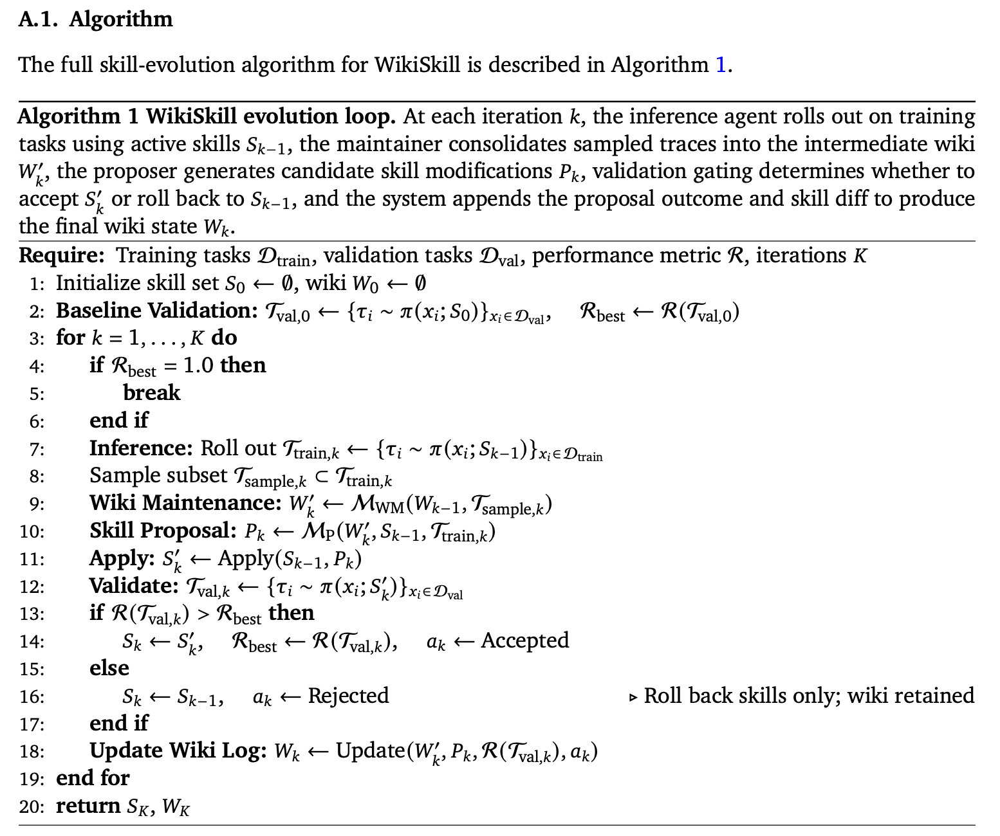



## 1. Summary

Agents can evolves skills iteratively from experience.  **WikiSkill** organizes the skill learning into three stages: collect execution traces, analyze and extract patterns, propose and validate skills. It consistently outperforms prior skill-evolution methods (such as *EvoSkill* and _SkillOpt_) as well as no-skill baselines, while the wiki layer is essential for steady, long-term agent improvement. 

## 2. Method

Each iteration of WikiSkill proceeds through 4 steps:
- **Inference**: The agent runs tasks on the training set using the current active skills. Traces are written to the Raw Layer.
- **Wiki Maintenance**: A specialized _Wiki Maintainer_ agent analyzes recent traces, performs root-cause analysis, and updates/consolidates structured patterns into the Wiki Layer.
- **Skill Proposal**: A _Skill Proposer_ agent reads the current skills, the consolidated Wiki patterns, and relevant traces to propose concrete updates or additions to the Skill Layer.
- **Validation Gating & Rollback**: The candidate skill set is evaluated on a validation split. If performance improves, the update is accepted; if it degrades, the skill set is rolled back. Even upon rollback, the Wiki retains the lessons learned from that failure.

## 3. Personal Insights

- **Rejection sampling**, originated in classical Monte Carlo statistics, generates data from a "hard" distribution by sampling from an "easy" distribution and throws away (rejecting) the candidates that don't meet a specific criterion. It is widely used across machine learning and LLM engineering to describe **generate-and-filter** loops, as does in WikiSkill.
  
  ####  The classical statistical origin
   Suppose you have a complex probability density function $p(x)$ that you want to sample from, but it is impossible or mathematically intractable to sample from directly.

  However, you _can_ easily sample from a simpler proposal distribution $q(x)$ (like a standard Gaussian or uniform distribution).
  
1. Find a constant $M$ such that $M \cdot q(x) \ge p(x)$ everywhere. The curve $M \cdot q(x)$ forms an upper bound or "envelope" covering $p(x)$.
    
2. Sample a candidate $x^*$ from the easy distribution $q(x)$.
    
3. Sample a uniform random number $u \sim \text{Uniform}(0, 1)$.
    
4. **Accept or Reject:**
    
    - **Accept** $x^*$ if:
        
        $$u \le \frac{p(x^*)}{M \cdot q(x^*)}$$
        
    - **Reject** $x^*$ otherwise and repeat.
- Text mutations don't have natural mathematical convergence, so systems like **WikiSkill**, **TextGrad**, or **EvoSkill** don't converge. They are liable to overfit and stagnate when acceptance rate drops to 0.

