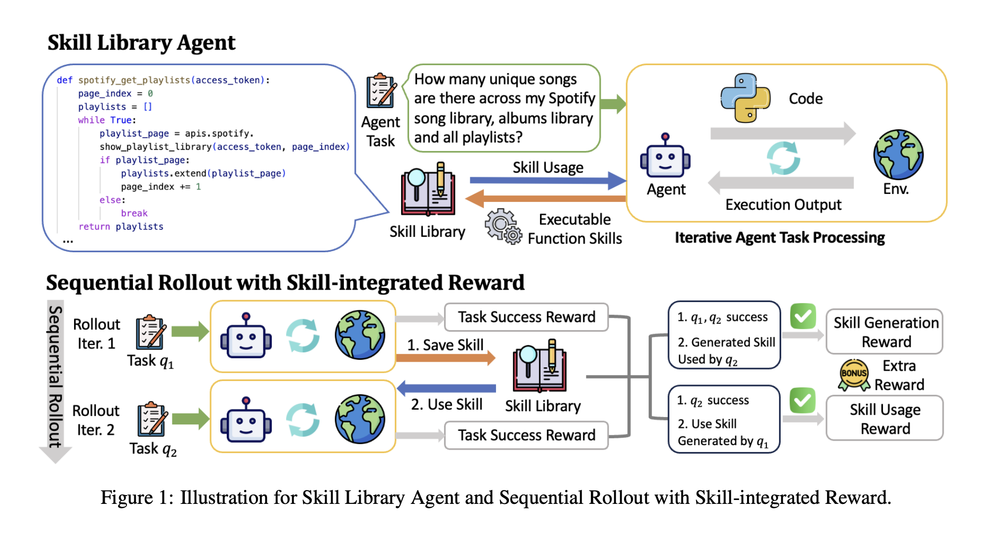



## 1. Summary

**SAGE**, a RL framework is proposed to train self-improving agents with skill library. Applied on the AppWorld dataset, SAGE incorporates **GRPO** with Sequential Rollout and Skill-integrated Reward and outperforms baselines in both accuracy and efficiency (**8.9%** higher Scenario Goal Completion, **26%** fewer interaction steps and **59%** fewer tokens).
## 2. Method
- **SFT warm-up** : The base instruct model is fine-tuned on a curated set of multi-turn trajectories demonstrating proper Python function abstraction, docstring writing, and execution, aligning the initial policy to reliably emit standard python code blocks. It results in the starting policy $\pi_\theta$ and the frozen reference model $\pi_{\text{ref}}$.

- **Sequential Task-Chain Rollout**: Rollouts are executed over paired task chains $(q_1, q_2)$ from the same scenario(prompting).  
	- The harness constructs the context from the active skill library $\mathcal{M}$ via dense vector match with the task query $q_1$, then the agent policy generates reasoning steps and Python code blocks executed in an isolated interactive REPL sandbox, likely defines a new python function and invokes it inline tosolve $q_1$. 
	- After that, task $q_2$ is launched with Inherited Library with the new python function generated by  $q_1$.
	
- **Harness Interception, AST Parsing & Skill Registration**: The harness automatically manages the python code sandbox execution and AST extraction (before and after code execution), , returning to the agent to retry on error messages, or operating skill library (add or update) on completion.

- **Skill-Integrated Cross-Task Reward Assignment**: the Benchmark DB Oracle evaluates the ground truth by inspecting DBs/flles and running invariant unit tests and compute the reward

- **Group Relative Policy Optimization (GRPO) Update**: For each task chain, the rollout policy samples a group of $G$ distinct candidate trajectories (from the steps above). With advantage normalization and gradient step,  the policy parameters $\theta$ are updated.

## 3. Key Mathematical Formulations

**The objective function to maximize with respect to policy parameters $\theta$** 

$$
\mathcal{J}_{\text{SAGE}}(\theta) = \mathbb{E}_{C \sim \mathcal{D}, \, \{ (o_1^{(i)}, o_2^{(i)}) \}_{i=1}^G \sim \pi_{\text{old}}} \left[ \frac{1}{G} \sum_{i=1}^G \sum_{k \in \{1, 2\}} \sum_{t=1}^{\vert{}o_k^{(i)}\vert{}} \mathcal{L}_{k, t}^{(i)}(\theta) \right]
$$
		For a task chain $C = (q_1, q_2)$ sampled from the task distribution $\mathcal{D}$, the rollout policy $\pi_{\text{old}}$ samples a group of $G$ independent trajectory chains $\{ (o_1^{(i)}, o_2^{(i)}) \}_{i=1}^G$.

**The per-token surrogate term $\mathcal{L}_{k, t}^{(i)}(\theta)$**
$$
	\mathcal{L}_{k, t}^{(i)}(\theta) = \min \left( \rho_{k, t}^{(i)}(\theta) \hat{A}_k^{(i)}, \; \text{clip}\left(\rho_{k, t}^{(i)}(\theta), 1 - \epsilon, 1 + \epsilon\right) \hat{A}_k^{(i)} \right) - \beta \, \mathbb{D}_{\text{KL}}\left(\pi_\theta(\cdot \mid s_{k, t}^{(i)}) \parallel \pi_{\text{ref}}(\cdot \mid s_{k, t}^{(i)})\right)
	$$
 **Importance Sampling Ratio $\rho_{k, t}^{(i)}(\theta)$**
	$$
	\rho_{k, t}^{(i)}(\theta) = \frac{\pi_\theta(y_{k, t}^{(i)} \mid s_{k, t}^{(i)})}{\pi_{\text{old}}(y_{k, t}^{(i)} \mid s_{k, t}^{(i)})}
	$$
		where $y_{k, t}^{(i)}$ is the token generated at step $t$ within task $q_k$, conditioned on context prefix state $s_{k, t}^{(i)}$.
	
**Skill-Integrated Rewards $R_1^{(i)}, R_2^{(i)}$**

The raw scalar returns incorporate downstream reuse flags alongside binary ground-truth task completion $r_1^{(i)}, r_2^{(i)} \in \{0, 1\}$:

$$
\begin{aligned} R_1^{(i)} &= r_1^{(i)} + \mathbf{1}[r_1^{(i)} = 1] \cdot \mathbf{1}[r_2^{(i)} = 1] \cdot \mathbf{1}_{\text{skill}}(q_2^{(i)} \mid q_1^{(i)}) \\ R_2^{(i)} &= r_2^{(i)} + \mathbf{1}[r_2^{(i)} = 1] \cdot \mathbf{1}_{\text{skill}}(q_2^{(i)} \mid q_1^{(i)}) \end{aligned}
$$
	$\mathbf{1}_{\text{skill}}(q_2^{(i)} \mid q_1^{(i)})$ is verified by the harness AST and runtime tracer (evaluating to $1$ only if $q_2$ retrieves and executes a function synthesized in $q_1$ without runtime exceptions).
	
**Group-Relative Advantage Estimation $\hat{A}_k^{(i)}$**

Rather than estimating baselines via a parametric Value Model $V_\phi(s)$, GRPO normalizes the reward across the $G$ sampled chains within the group:

$$
\hat{A}_k^{(i)} = \frac{R_k^{(i)} - \text{mean}\left(\{R_k^{(1)}, R_k^{(2)}, \dots, R_k^{(G)}\}\right)}{\text{std}\left(\{R_k^{(1)}, R_k^{(2)}, \dots, R_k^{(G)}\}\right) + \delta}
$$
	where $\delta$ is a small constant (e.g., $10^{-8}$) preventing division by zero.
	
**KL Divergence Penalty $\mathbb{D}_{\text{KL}}$**

To prevent entropy collapse and catastrophic drift away from the base policy, the unbiased estimator (Schulman approximation) is computed per-token:

$$
\mathbb{D}_{\text{KL}}\left(\pi_\theta \parallel \pi_{\text{ref}}\right) \approx \frac{\pi_{\text{ref}}(y_{k, t}^{(i)} \mid s_{k, t}^{(i)})}{\pi_\theta(y_{k, t}^{(i)} \mid s_{k, t}^{(i)})} - \log \left(\frac{\pi_{\text{ref}}(y_{k, t}^{(i)} \mid s_{k, t}^{(i)})}{\pi_\theta(y_{k, t}^{(i)} \mid s_{k, t}^{(i)})}\right) - 1
$$ scaled by hyperparameter $\beta$.
## 4. Personal Insights
- The Baselines
	- Instruct models like **Qwen2.5-32B-Instruct**, **GPT-4o** and **Claude 3.5 Sonnet**
	- Instruct models fine-tuned via SFT
	- Models with prompt-based/in-context skill induction (e.g. **Voyager**)
	- Standard GRPO (Single-Task, Outcome Reward Only, e.g. **LOOP**)
- SAGE tailors its reward function to the AppWorld dataset that consists of sequential queries with the same scenario. **Its vast majority of generated skills are programmatic compositions and workflows over existing primitive APIs**. Each skill entry in $\mathcal{M}$ contains fields like name, code, docstring and vector embedding, whose full source code is injected into the context after retrievals. 
- There are **3 models**/policies
	- Reference Model $\pi_{\text{ref}}$ is the initial post-SFT before RL. it's frozen. It is for KL divergence to prevent policy collapse
	- Old Policy $\pi_{\text{old}}$ is the copy of $\pi_\theta$ at the start of each rollout epoch. It is for **importance sampling ratio** $r_t(\theta) = \frac{\pi_\theta}{\pi_{\text{old}}}$. It's frozen per rollout batch.
	- Current policy $\pi_\theta$ is trained and updated every optimizer step
- When **serving SAGE in production**, there are two planes
	- **Online Serving Plan**e
		- The policy and skills library are frozen
		- The prompt is adjusted with removal of the instructions to encourage inline function synthesis and skill generation
	- **Offline Shadow Evolution Plane**
		- Cluster the execution trajectories that requires repetitive, multi-step API sequences
		- Run an agent over these trace clusters to synthesize candidate skills
		- Evaluate candidate skills against a comprehensive golden test dataset
		- A/B experimentation 
