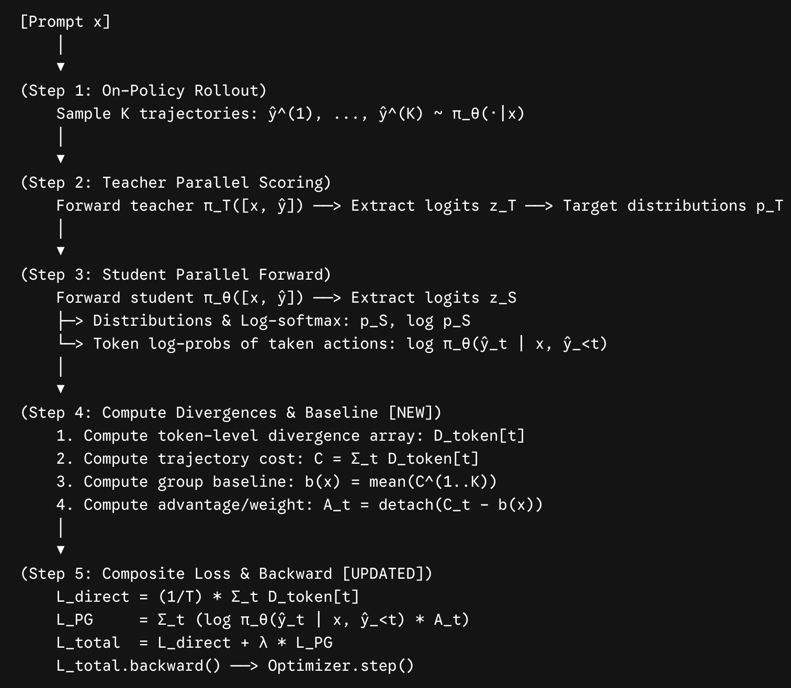



## 1. Summary
Common claims in recent literature suggest that on-policy rollouts reduces catastrophic forgetting, produces sparser parameter updates, and improves generalisation compared to off-policy supervised fine-tuning (SFT). However, the authors argue that: 

- On-policy rollouts are **NOT** universally preferable for strong-to-weak distillation
- The choice of token-level KL divergence strongly affects task performance, training stability and output coverage. Forward KL ($\mathrm{KL}(\pi_T \parallel \pi_S)$) is robust across both on-policy and off-policy (zero-avoiding); Reverse KL ($\mathrm{KL}(\pi_S \parallel \pi_T)$) is highly sensitive to rollout source (mode-seeking).
- Catastrophic forgetting and update sparsity are driven by the learning rate
- On-policy rollouts generalizes in more complex or out-of-distribution reasoning task and resists incidental teacher-style transfer
## 2. Method
- 1. Isolates two orthogonal axes under identical model architectures, optimizers, and learning rate schedules

| Divergence Metric                                     | Off-Policy Data ($\mathbf{y} \sim \pi_T$)     | On-Policy Data ($\hat{\mathbf{y}} \sim \pi_S$)         |
| ----------------------------------------------------- | --------------------------------------------- | ------------------------------------------------------ |
| **Forward KL** ($\mathrm{KL}(\pi_T \parallel \pi_S)$) | **Off-Policy Forward KL** (Standard soft SFT) | **On-Policy Forward KL** (Interactive DAgger style)    |
| **Reverse KL** ($\mathrm{KL}(\pi_S \parallel \pi_T)$) | Off-Policy Reverse KL                         | **On-Policy Reverse KL** (Standard RL / MiniLLM style) |

- 2. distils teachers (**Llama-3.1-8B, Qwen2.5- 7B**) into students(**Llama-3.2-1B, Qwen2.5-1.5B**), and assesses held-out accuracy, catastrophic forgetting and parameter-update sparsity on medical, science and arithmetic reasoning tasks.

## 3. Key Mathematical Formulations

**Strong-to-Weak Distillation Loss Function**

$$
\mathcal{L}(\theta) = \mathbb{E}_{x \sim p_{\text{data}}} \mathbb{E}_{y \sim \rho(\cdot \mid x)} \left[ \frac{1}{L_y} \sum_{n=1}^{L_y} \mathcal{D}\Big(\pi_S^\theta(\cdot \mid x, y_{\lt n}) \;\Big\Vert{}\; \pi_T(\cdot \mid x, y_{\lt n})\Big) \right]
$$

- **$x \sim p_{\text{data}}$** is the prompt
- **$\rho(\cdot \mid x)$** is the **rollout policy** used to autoregressively sample the sequence continuation $y$ of length $L_y$
- **On-Policy ($\text{OnPD}$):** $\rho = \pi_S^\theta$ (the student generates the trajectory)
- **Off-Policy ($\text{OffPD}$):** $\rho = \pi_T$ (the frozen teacher generates the trajectory)
- **$\mathcal{D}$** is the token-level discrepancy metric evaluated across the vocabulary $\mathcal{V}$ at step $n$, conditioned on prefix $(x, y_{\lt n})$

**Forward KL ($\mathcal{D}_{\text{F-KL}}$)**

$$
\mathcal{D}_{\text{F-KL}}\Big(\pi_T \;\Big\Vert{}\; \pi_S^\theta\Big) = \sum_{v \in \mathcal{V}} \pi_T(v \mid x, y_{\lt n}) \log \frac{\pi_T(v \mid x, y_{\lt n})}{\pi_S^\theta(v \mid x, y_{\lt n})}
$$

$$
\nabla_{(z_S^\theta)_v} \mathcal{D}_{\text{F-KL}} = \pi_S^\theta(v) - \pi_T(v)
$$

$$
\nabla_\theta D_{\mathrm{KL}}(\pi_T \,\|\, \pi_S^\theta) = \sum_{v \in V} \bigl( \pi_S^\theta(v) - \pi_T(v) \bigr)\, \nabla_\theta (z_S^\theta)_v
$$

**Reverse KL ($\mathcal{D}_{\text{R-KL}}$)**

$$
\mathcal{D}_{\text{R-KL}}\Big(\pi_S^\theta \;\Big\Vert{}\; \pi_T\Big) = \sum_{v \in \mathcal{V}} \pi_S^\theta(v \mid x, y_{\lt n}) \log \frac{\pi_S^\theta(v \mid x, y_{\lt n})}{\pi_T(v \mid x, y_{\lt n})}
$$

$$
\nabla_{(z_S^\theta)_v} \mathcal{D}_{\text{R-KL}} = \pi_S^\theta(v) \left[ \log \frac{\pi_S^\theta(v)}{\pi_T(v)} - \mathcal{D}_{\text{R-KL}} \right]
$$

$$
\nabla_\theta D_{\text{R-KL}} = \mathbb{E}_{v \sim \pi_S^\theta} \left[ \left( \log \frac{\pi_S^\theta(v)}{\pi_T(v)} - D_{\text{R-KL}} \right) \nabla_\theta \log \pi_S^\theta(v) \right]
$$

Let $(z_S^\theta)_v,\, v \in V$ denote the logit values produced by the student model at a fixed prefix, with $\pi_S^\theta(v) = \text{softmax}(z_S^\theta)_v$.
## 4. Personal Insights
- Zero-avoiding (Forward KL, $\mathrm{KL}(\pi_T \parallel \pi_S)$): Wherever the teacher places mass, the student must place non-zero mass — otherwise $\log(\pi_T / \pi_S)$ blows up and the divergence is infinite. a.k.a **"Never miss any region where $\pi_T > 0$"**.The student is pushed to cover all of the teacher's modes, even if that means spreading probability over low-density regions.
- Mode-seeking (Reverse KL, $\mathrm{KL}(\pi_S \parallel \pi_T)$): Wherever the teacher assigns zero mass, the student must also assign zero — otherwise $\log(\pi_S / \pi_T)$ blows up. a.k.a **"Never generate in regions where $\pi_T=0$"**. The reverse is not penalized: the student can safely ignore regions where the teacher has mass, because the integrand $\pi_S \log(\pi_S / \pi_T)$ vanishes when $\pi_S = 0$. The student therefore collapses onto a single mode of a multimodal teacher.
- Standard SFT optimizes the cross-entropy that collapses to the negative log-likelihood of that single token $$\mathcal{L}_{\text{SFT}}(\theta) = -\sum_{v \in \mathcal{V}} \mathbf{p}_T^{(t)}(v) \log \mathbf{p}_S^{(t)}(v) = -\log \mathbf{p}_S^{(t)}(y_t^*)$$ and gradient on student logits $\mathbf{z}_S$:$$\nabla_{\mathbf{z}_S} \mathcal{L}_{\text{SFT}} = \mathbf{p}_S^{(t)} - \mathbf{1}_{y_t^*}$$
- Soft-SFT (often called _Off-Policy Forward-KL Distillation_) the target is the full continuous probability vector emitted by the teacher model, so the cross entropy loss is evaluated over the entire vocabulary:$$\mathcal{L}_{\text{Soft-SFT}}(\theta) = -\sum_{v \in \mathcal{V}} \mathbf{p}_T^{(t)}(v) \log \mathbf{p}_S^{(t)}(v)$$ Gradient on student logits $\mathbf{z}_S$:$$\nabla_{\mathbf{z}_S} \mathcal{L}_{\text{Soft-SFT}} = \mathbf{p}_S^{(t)} - \mathbf{p}_T^{(t)}$$
- In standard on-policy distillation frameworks, (such as Generalized Knowledge Distillation / GKD, MiniLLM, and On-Policy Distillation / OPD), the training loop executes four phases per batch
	- On-policy student rollout generation at inference mode. input: $x \sim \mathcal{D}_{\text{prompts}}$, output:
	$$\hat{y} \sim \pi_\theta(\cdot \mid x) = (\hat{y}_1, \hat{y}_2, \dots, \hat{y}_T)$$
	- Teacher parallel scoring in a single forward pass. input: prompt + rollout $[x, \hat{y}_1, \dots, \hat{y}_T]$, output: logit for every position $$\mathbf{z}_T \in \mathbb{R}^{B \times T \times \vert{}\mathcal{V}\vert{}}$$ and softmax transformation with the distillation temperature $\tau$. $$\mathbf{p}_T^{(t)} = \operatorname{softmax}\left(\frac{\mathbf{z}_T^{(t)}}{\tau}\right) \in \Delta^{\vert{}\mathcal{V}\vert{}}$$
	- Student parallel forward pass over $[x, \hat{y}]$ with autograd enabled. same input: prompt + rollout $[x, \hat{y}_1, \dots, \hat{y}_T]$, output: logits, softmax, log-softmax. $$\mathbf{z}_S \in \mathbb{R}^{B \times T \times \vert{}\mathcal{V}\vert{}}$$
	- $$\mathbf{p}_S^{(t)} = \operatorname{softmax}\left(\frac{\mathbf{z}_S^{(t)}}{\tau}\right), \quad \log \mathbf{p}_S^{(t)} = \operatorname{log\_softmax}\left(\frac{\mathbf{z}_S^{(t)}}{\tau}\right)$$
	- Token-by-token divergence computation & backward pass. forward KL ($\pi_T \parallel \pi_\theta$):$$\mathcal{L}_{\text{F-KL}}(\theta) = -\tau^2 \sum_{t=1}^{T} \sum_{v \in \mathcal{V}} \mathbf{p}_T^{(t)}(v) \log \mathbf{p}_S^{(t)}(v)$$ or reverse KL ($\pi_\theta \parallel \pi_T$): $$\mathcal{L}_{\text{R-KL}}(\theta) = \tau^2 \sum_{t=1}^{T} \sum_{v \in \mathcal{V}} \mathbf{p}_S^{(t)}(v) \left[\log \mathbf{p}_S^{(t)}(v) - \log \mathbf{p}_T^{(t)}(v)\right]$$
- Policy gradient correction will add an additional **score function item or term 1** to the loss function$$\mathcal{L}_{\text{total}}(\theta) = \underbrace{\frac{1}{T} \sum_{t=1}^{T} D_{\text{token}}^{(t)}}_{\mathcal{L}_{\text{direct}} \text{ (Term 2: pathwise logits)}} + \;\; \underbrace{\sum_{t=1}^{T} \log \pi_\theta(\hat{y}_t \mid x, \hat{y}_{\lt t}) \cdot \operatorname{detach}\Big(C_t(\hat{y}) - b(x)\Big)}_{\mathcal{L}_{\text{PG}} \text{ (Term 1: score function / policy gradient)}}$$
$$C(\hat{y}) = \sum_{t=1}^{T} D_{\text{token}}^{(t)} \quad \text{where} \quad D_{\text{token}}^{(t)} = D_{\mathrm{KL}}\Big(\pi_T(\cdot \mid x, \hat{y}_{\lt t}) \;\Big\Vert{}\; \pi_\theta(\cdot \mid x, \hat{y}_{\lt t})\Big)$$
	the trajectory-level cost as the unweighted sum of token-level divergence errors. and the whole training loop is as follows:

	
